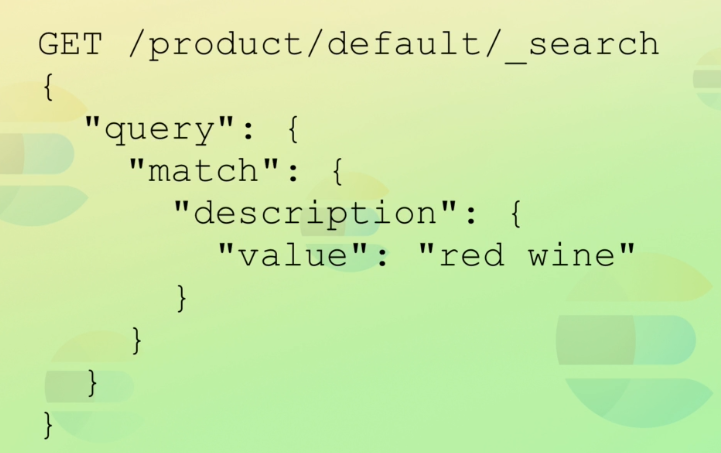
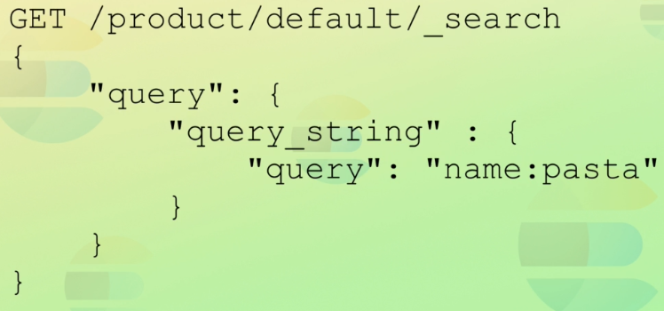
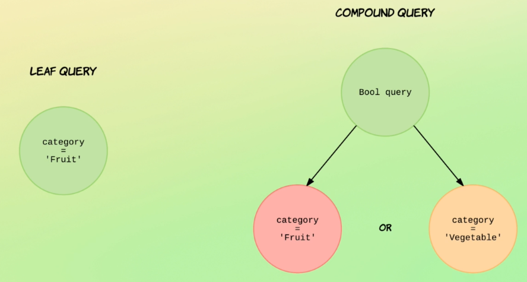

#Intro to dynamic mapping

## Search Methods

--

--

## Searching With Request URI

## Introducing the Query DSL

## How Searcghing Works

## Understanding Query Results

## Understanding Relevance scores
**TF/IFD** -> Term Frequency / Inverse Document Frequency

**Algo Okapi BM25** -> relevance scoring algo used by ES

**TF** -> How many times does the term appear in the given doc.

**IDF** -> How often the term appears withing the index i. across all docs.

**Field Length norm** -> Longer the field, less likely to be picked.

## Debugging Unexpected Search Results

## Query Contexts

## Full text queries vs term level queries