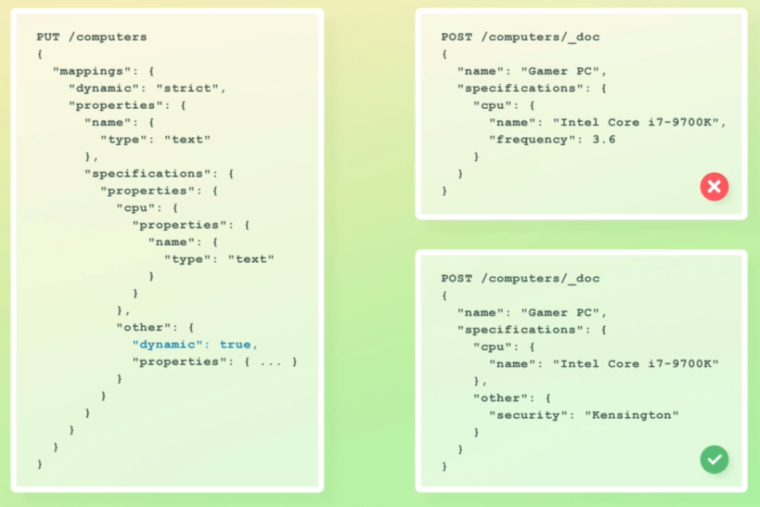
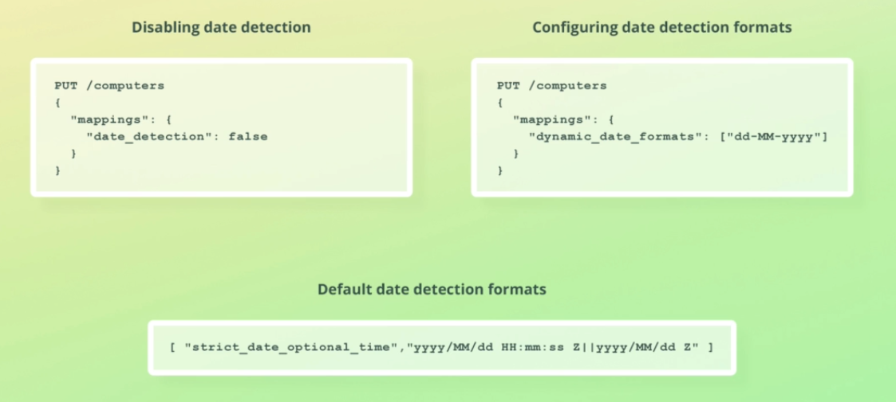

# Configuring dynamic mapping
Controlled by `dynamic` field.
## Disable dynamic mapping
Setting it to false will make es to ignore new field i.e they are not indexed but would still be part of _source.
No inverted index is created for `last_name`
Querying field will not give results.
Fields can not be indexed without mapping. When enabled, dynamic mapping creates one before indexing values.
New fields must be mapped explictly if we want them to be indexed.
```
PUT /people
{
  "mappings": {
    "dynamic": false,
    "properties": {
      "first_name": {
        "type": "text"
      }
    }
  }
}
```

## Set dynamic mapping to `strict`
Es will reject unmapped fields. All fields must be mapped explicitly. This behavior is similar to RDS.
Will reject insertion saying not allowed and we would have to do the mapping first.
```
PUT /people
{
  "mappings": {
    "dynamic": "strict",
    "properties": {
      "first_name": {
        "type": "text"
      }
    }
  }
}
```

## Index a test document
```
POST /people/_doc
{
  "first_name": "Bo",
  "last_name": "Andersen"
}
```

## Retrieve mapping
```
GET /people/_mapping
```

## Search `first_name` field
```
GET /people/_search
{
  "query": {
    "match": {
      "first_name": "Bo"
    }
  }
}
```

## Search `last_name` field
```
GET /people/_search
{
  "query": {
    "match": {
      "last_name": "Andersen"
    }
  }
}
```

## Clean up
```
DELETE /people
```

# Inheritance


## Numeric Detection 


## Date detection

