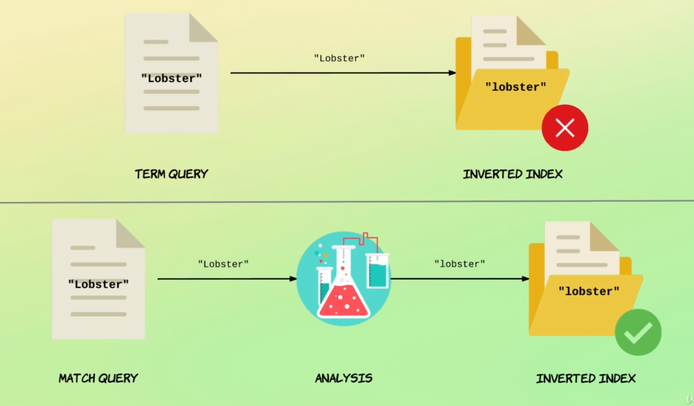

# Full text queries vs term level queries

## Term level queries are not analyzed
Yields results
```
GET /products/_search
{
  "query": {
    "term": {
      "name": "lobster"
    }
  }
}
```

No results are shown

```
GET /products/_search
{
  "query": {
    "term": {
      "name": "Lobster"
    }
  }
}
```

## Full-text queries are analyzed

```
GET /products/_search
{
  "query": {
    "match": {
      "name": "Lobster"
    }
  }
}
```

