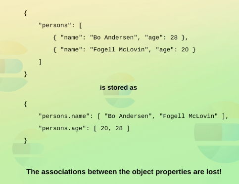

# Querying nested objects

## Creating the index with mapping
It will have department name and a list of employees. 
We let dynamic mapping of ES handle the mapping of employees.

```
PUT /department
{
  "mappings": {  
    "properties": {
      "name": {
        "type": "text"
      },
      "employees": {
        "type": "nested"
      }
    }
  }
}
```

## Adding documents to department index

```
PUT /department/_doc/1
{
  "name": "Development",
  "employees": [
    {
      "name": "Eric Green",
      "age": 39,
      "gender": "M",
      "position": "Big Data Specialist"
    },
    {
      "name": "James Taylor",
      "age": 27,
      "gender": "M",
      "position": "Software Developer"
    },
    {
      "name": "Gary Jenkins",
      "age": 21,
      "gender": "M",
      "position": "Intern"
    },
    {
      "name": "Julie Powell",
      "age": 26,
      "gender": "F",
      "position": "Intern"
    },
    {
      "name": "Benjamin Smith",
      "age": 46,
      "gender": "M",
      "position": "Senior Software Engineer"
    }
  ]
}
```

```
PUT /department/_doc/2
{
  "name": "HR & Marketing",
  "employees": [
    {
      "name": "Patricia Lewis",
      "age": 42,
      "gender": "F",
      "position": "Senior Marketing Manager"
    },
    {
      "name": "Maria Anderson",
      "age": 56,
      "gender": "F",
      "position": "Head of HR"
    },
    {
      "name": "Margaret Harris",
      "age": 19,
      "gender": "F",
      "position": "Intern"
    },
    {
      "name": "Ryan Nelson",
      "age": 31,
      "gender": "M",
      "position": "Marketing Manager"
    },
    {
      "name": "Kathy Williams",
      "age": 49,
      "gender": "F",
      "position": "Senior Marketing Manager"
    },
    {
      "name": "Jacqueline Hill",
      "age": 28,
      "gender": "F",
      "position": "Junior Marketing Manager"
    },
    {
      "name": "Donald Morris",
      "age": 39,
      "gender": "M",
      "position": "SEO Specialist"
    },
    {
      "name": "Evelyn Henderson",
      "age": 24,
      "gender": "F",
      "position": "Intern"
    },
    {
      "name": "Earl Moore",
      "age": 21,
      "gender": "M",
      "position": "Junior SEO Specialist"
    },
    {
      "name": "Phillip Sanchez",
      "age": 35,
      "gender": "M",
      "position": "SEM Specialist"
    }
  ]
}
```

## Querying nested fields
To find which departments have female interns.
Because these are 2 queries we need to wrap in bool query.
```
GET /department/_search
{
  "query": {
    "nested": {
      "path": "employees",
      "query": {
        "bool": {
          "must": [
            {
              "match": {
                "employees.position": "intern"
              }
            },
            {
              "term": {
                "employees.gender.keyword": {
                  "value": "F"
                }
              }
            }
          ]
        }
      }
    }
  }
}
```



problem with this approach is employees are stored in departments itself and would be difficuklt to keep up to date